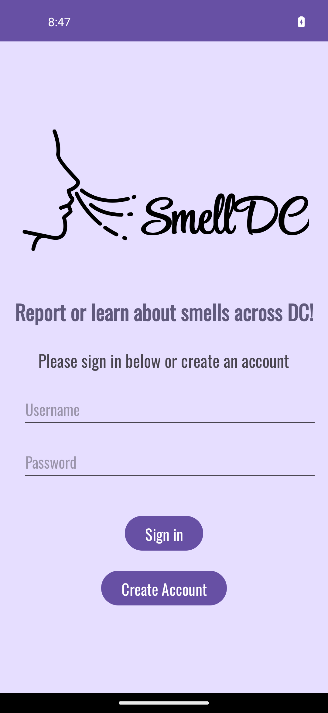
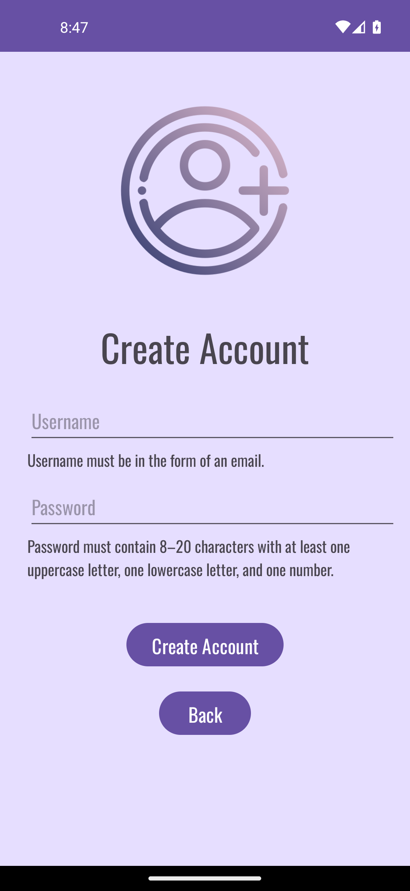

# SmellDC

## Description
SmellDC is an app that allows users to report smells about areas within Washington DC. Users can use the map to select a location within DC to use as the location for their 
smell report on or simply view the daily smell reports submitted by other users of the app (the map only shows user reports submitted on the current day). 
The map uses markers to represent an individual user report that was submitted that day. A pink marker represents a report submitted by another user, while a red marker 
represents a report submitted by the currently logged in user. Clicking on these markers allows the user to view detailed information within that report.

Users are also able to view a quick summary of the submitted reports so far for that day separated by region (Northwest, Northeast, Southwest, and Southeast). 
This summary, or 'Quick Stats', includes the total number of reports for each region, number of each report rating, and number of reported health issues.

In addition to creating and viewing daily smell reports, users can view their history of submitted reports.

User authentication and report related data is stored through the Google Firebase platform.

## Demo 
https://youtu.be/QpzEfbjMJ7k

## Images
### Login page

### Creating account

### Welcome page

